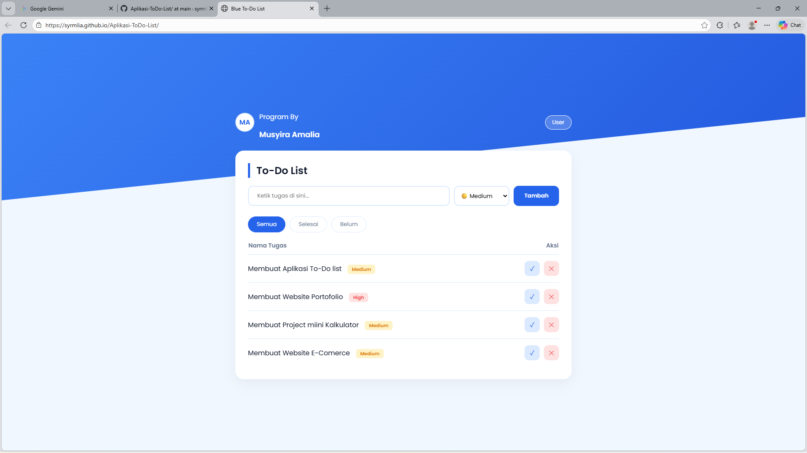

# To-Do List Web App

A simple web-based to-do list application built to practice front-end development.

## Features
- Add new tasks
- Mark tasks as completed
- Delete tasks
- Simple and clean user interface

## Tech Stack
- HTML
- CSS
- JavaScript

## Purpose
This project was created as a mini project to improve my understanding of JavaScript DOM manipulation and basic front-end logic.

## Screenshot

## Live Demo
https://syrmlia.github.io/Aplikasi-ToDo-List/
